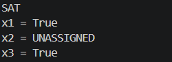

# SAT Solver in C++

A modular SAT Solver built in C++ using a structured, phase-based approach.
This project implements CNF parsing, DPLL-based solving, and key optimizations from discrete mathematics.

---

## 🚀 Features

* ✅ DIMACS CNF file parsing
* ✅ Three-state assignment system
* ✅ Clause & formula evaluation engine
* ✅ DPLL (backtracking SAT solver)
* ✅ Unit propagation optimization
* ✅ Pure literal elimination
* ✅ SAT assignment output

---

## 🧠 Core Concepts

### Boolean Satisfiability (SAT)

Determine whether a Boolean formula can be satisfied by assigning TRUE/FALSE values to variables.

---

### CNF (Conjunctive Normal Form)

A formula is:

* AND of clauses
* Each clause is an OR of literals

Example:
1 -2 0 → (x₁ ∨ ¬x₂)

---

### Assignment System

| Value | Meaning    |
| ----- | ---------- |
| 1     | TRUE       |
| -1    | FALSE      |
| 0     | UNASSIGNED |

---

## ⚙️ Algorithm Overview

### DPLL Algorithm

1. Apply **Unit Propagation**
2. Apply **Pure Literal Elimination**
3. Choose an unassigned variable
4. Try TRUE / FALSE (backtracking)

---

## 📸 Demo

---

## 📂 Project Structure

sat-solver/
│
├── src/
│   ├── main.cpp
│   ├── parser.cpp
│   ├── solver.cpp
│
├── include/
│   ├── parser.h
│   ├── solver.h
│
├── test/
│   ├── sample.cnf
│
├── demo/
│   └── screenshot.png   ← (add your screenshot here)
│
├── .gitignore
└── README.md

---

## ⚙️ Compilation

### Linux / Mac

g++ -std=c++17 src/*.cpp -Iinclude -o sat_solver

### Windows

g++ -std=c++17 src/*.cpp -Iinclude -o sat_solver.exe

---

## ▶️ Run

### Linux / Mac

./sat_solver test/sample.cnf

### Windows

sat_solver.exe test/sample.cnf

---

## 🧪 Example Output

SAT
x1 = TRUE
x2 = FALSE
x3 = TRUE

---

## 📘 DIMACS CNF Format

Example:
c Example CNF
p cnf 3 2
1 -2 0
2 3 0

---

## 🛠️ Roadmap

* [x] Phase 1: CNF Parser
* [x] Phase 2: Assignment & Evaluation
* [x] Phase 3: DPLL Solver
* [x] Phase 4: Unit Propagation
* [x] Phase 5: Pure Literal Elimination
* [x] Phase 6: SAT Assignment Output

---

## 💡 Tech Stack

* C++
* STL (Standard Template Library)

---

## 📌 Author

Moulik Choudhary
CSE Student | Systems & Problem Solving Enthusiast

---

## ⭐ Notes

This project demonstrates:

* Clean modular design
* Application of discrete mathematics
* Real-world algorithm implementation

---

## 🤝 Contributions

Suggestions, optimizations, and improvements are welcome!
